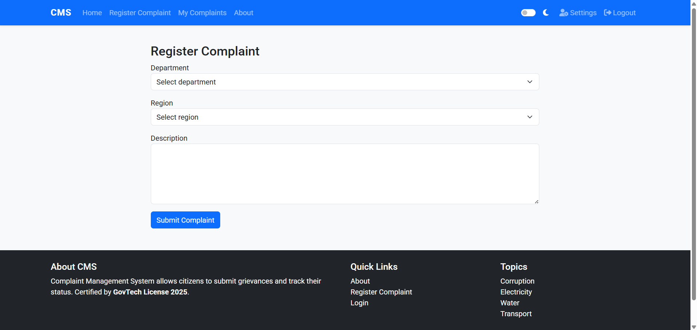

# Complaint Management System (CMS)

A web-based **Complaint Management System** that allows citizens to submit complaints to relevant departments, track their status online, and enables administrators to manage and update complaints efficiently. The system features a modern UI with dark/light mode toggle, animations, and topic-based navigation.

---

## Table of Contents
- [Features](#features)
- [Technology Stack](#technology-stack)
- [File Structure](#file-structure)
- [Installation](#installation)
- [Database Setup](#database-setup)
- [Usage](#usage)
- [Screenshots](#screenshots)
- [Future Enhancements](#future-enhancements)
- [License](#license)

---

## Features

### For Citizens
- Register and log in securely.
- Submit complaints to various departments (Electricity, Corruption, Roads, Police Grievance, etc.).
- Select region for complaints.
- Track the status of submitted complaints.
- Update personal settings (e.g., region).
- Modern UI with dark/light theme toggle.

### For Admins
- View all complaints with filters by department and region.
- Update complaint status (Pending, In Progress, Resolved, Under Review).
- Access dashboard with all submitted complaints.
- Interactive interface for quick management.

### UI Enhancements
- Topic browsing section with clickable topics.
- Smooth animations and hover effects for buttons.
- Responsive design for desktop and mobile.
- Dark/light mode toggle with persistent preference.

---

## Technology Stack

- **Backend:** Python 3, Flask
- **Frontend:** HTML5, CSS3, Bootstrap 5, jQuery
- **Database:** SQLite
- **Authentication:** Session-based, hashed passwords with `werkzeug.security`
- **Deployment:** Local server (can be deployed to any WSGI-compatible server)

---

## File Structure

project/
│
├── app.py # Main Flask application
├── create_db.py # Script to create SQLite DB and add admin user
├── requirements.txt # Python dependencies
│
├── static/
│ ├── css/
│ │ └── style.css # Custom styles and dark mode variables
│ └── js/
│ └── script.js # JS for theme toggle and form validation
│
└── templates/
├── base.html # Base template with navbar, footer, dark mode toggle
├── index.html # Homepage with jumbotron and topic buttons
├── login.html # Login page
├── register.html # Citizen registration page
├── complaint_form.html # Complaint submission form
├── success.html # Generic success page
├── citizen_dashboard.html # Dashboard for citizens to view their complaints
├── admin_dashboard.html # Admin dashboard to view & update complaints
├── about.html # About page
└── settings.html # User settings page

## Database Setup

- Run the database creation script:
- python create_db.py

## Usage

Start the Flask app:
- python app.py

## Open your browser and visit:
- http://127.0.0.1:5000

### Homepage

### Login Page

### Register Page

### Complaint Form

### Citizen Dashboard

### Admin Dashboard

